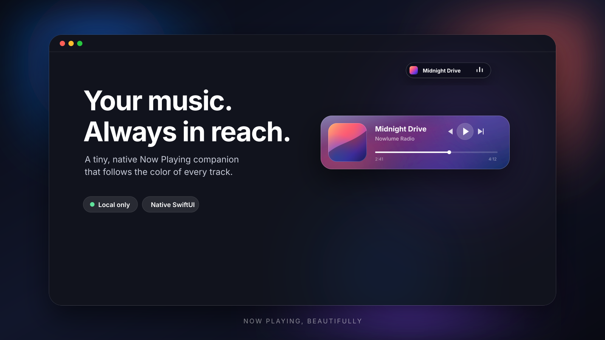
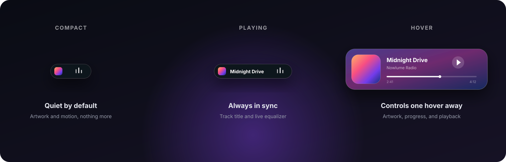

<div align="center">
  
  <h1>Nowlume</h1>
  <p><strong>A beautiful, always-ready Now Playing companion for macOS.</strong></p>
  <p>
    
    
    
    
  </p>
</div>



Nowlume turns the system-wide **Now Playing** session into a compact, tactile player that lives in your menu bar. Album artwork shapes the interface in real time, controls stay one hover away, and the player quietly disappears when the music stops.

It works with Yandex Music and other macOS players that publish playback metadata to Control Center — without account sign-in, browser extensions, or cloud services.

## At a glance



| | |
|---|---|
| **Artwork-aware color** | A vivid animated background is generated from every album cover. |
| **Instant playback controls** | Previous, play/pause, next, and locally extrapolated progress. |
| **Menu bar native** | A compact title, artwork, and animated equalizer live beside the system controls. |
| **Out of the way** | The floating player appears on hover and hides when playback stops. |
| **Personalized behavior** | Always on Top, Launch at Login, Reduce Animations, and saved positioning. |
| **Private by design** | No account, analytics, remote backend, or playback history collection. |

## Why Nowlume

Music apps are great at managing libraries. They are less great at staying accessible while you work. Nowlume is deliberately smaller: it reflects the track macOS is already playing and gives you the few controls you need without pulling you into another full-size window.

The name combines **Now Playing** with **lume** — light. The interface follows the color and energy of whatever is playing now.

## Requirements

- macOS 14 Sonoma or newer
- Apple silicon or Intel Mac supported by macOS 14
- A player visible in macOS Control Center's Now Playing section
- Xcode 15 or newer when building from source

## Build and run

```bash
git clone https://github.com/wwenderr/Nowlume.git
cd Nowlume
open YandexMiniPlayer.xcodeproj
```

In Xcode, select the **YandexMiniPlayer** scheme and **My Mac**, then press `⌘R`. Start a track in Yandex Music, Apple Music, Spotify, or another Now Playing-compatible app.

> [!NOTE]
> The Xcode target still uses its original internal name. The product displayed to users is **Nowlume**.

## How it works

```text
macOS Now Playing session
          ↓
  MediaRemote provider
          ↓
    PlayerViewModel
       ↙       ↘
 menu bar     floating panel
```

The visual layer talks only to `NowPlayingProvider`. `MediaRemoteProvider` is the current implementation, keeping the SwiftUI interface independent from the playback source and making a future provider replacement straightforward.

## Project structure

```text
YandexMiniPlayer/
├── App/          Window, lifecycle, and preferences
├── Models/       Track state
├── Playback/     Now Playing provider and MediaRemote bridge
├── Services/     Color extraction and Launch at Login
├── UI/           Player, artwork, controls, progress, and settings
└── Resources/    App icon, asset catalog, plist, and helper script
```

## A note on MediaRemote

Nowlume dynamically accesses macOS's private MediaRemote framework. That makes the current build suitable for personal distribution and experimentation, but not for Mac App Store submission. Apple may change this private API in a future macOS release; the provider boundary is designed to keep that change isolated.

## Troubleshooting

- If metadata does not appear, confirm that the track is visible in macOS Control Center and wait up to three seconds.
- If controls do not respond, try pausing and resuming from the source player once.
- Launch at Login can be reviewed under **System Settings → General → Login Items**.

---

<div align="center">
  <sub>Native SwiftUI. No web view. No account. Just the music playing now.</sub>
</div>
